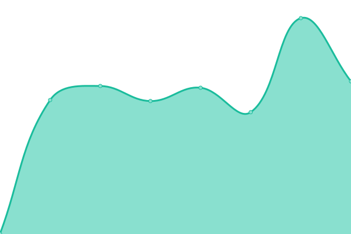

# [📈 Live Status](https://upptime.github.io/upptime): <!--live status--> **🟧 Partial outage**

This repository contains the open-source uptime monitor and status page for [Upptime](https://upptime.js.org), powered by [Upptime](https://github.com/upptime/upptime).

With [Upptime](https://upptime.js.org), you can get your own unlimited and free uptime monitor and status page, powered entirely by a GitHub repository. We use [Issues](https://github.com/upptime/upptime/issues) as incident reports, [Actions](https://github.com/worick/upptime/actions) as uptime monitors, and [Pages](https://upptime.github.io/upptime) for the status page.

<!--start: status pages-->
<!-- This summary is generated by Upptime (https://github.com/upptime/upptime) -->
<!-- Do not edit this manually, your changes will be overwritten -->
<!-- prettier-ignore -->
| URL | Status | History | Response Time | Uptime |
| --- | ------ | ------- | ------------- | ------ |
|  [HealingTour](https://www.healingtour.com) | 🟥 Down | [healing-tour.yml](https://github.com/worick/upptime/commits/HEAD/history/healing-tour.yml) | 

 904ms
     
 | 

<a href="https://worick.github.io/upptime/history/healing-tour">99.91%</a>
    

|  [Jhferry](https://www.jhferry.com) | 🟥 Down | [jhferry.yml](https://github.com/worick/upptime/commits/HEAD/history/jhferry.yml) | 

 940ms
     
 | 

<a href="https://worick.github.io/upptime/history/jhferry">99.99%</a>
    

|  [ATNSoft](http://atnsoft.co.kr) | 🟥 Down | [atn-soft.yml](https://github.com/worick/upptime/commits/HEAD/history/atn-soft.yml) | 

 687ms
     
 | 

<a href="https://worick.github.io/upptime/history/atn-soft">100.00%</a>
    

|  [DEMO](http://demo.atnsoft.co.kr) | 🟩 Up | [demo.yml](https://github.com/worick/upptime/commits/HEAD/history/demo.yml) | 

 479ms
     
 | 

<a href="https://worick.github.io/upptime/history/demo">100.00%</a>
    

<!--end: status pages-->

[**Visit our status website →**](https://upptime.github.io/upptime)

## 📄 License

- Powered by: [Upptime](https://github.com/upptime/upptime)
- Code: [MIT](./LICENSE) © [Upptime](https://upptime.js.org)
- Data in the `./history` directory: [Open Database License](https://opendatacommons.org/licenses/odbl/1-0/)
